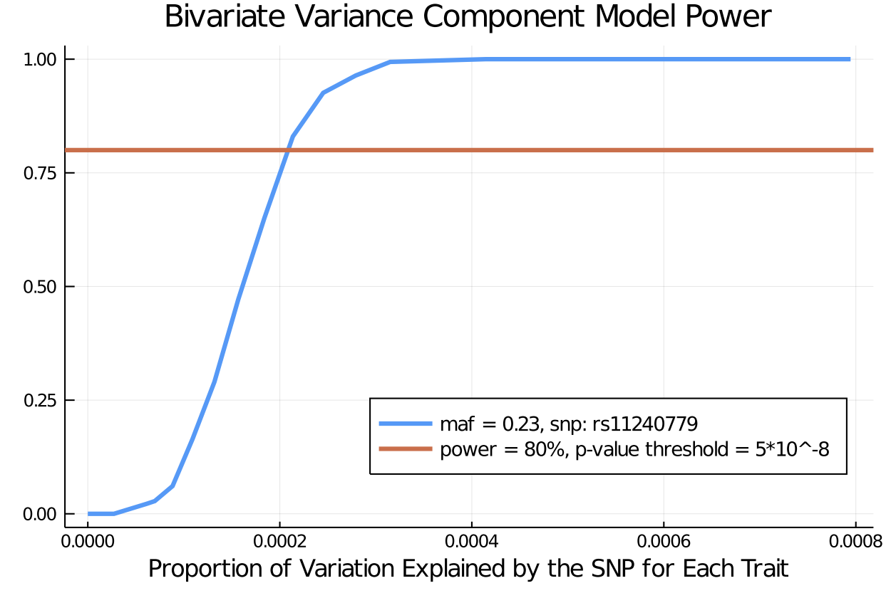

# Trait Simulation - Variance Component Model Power (UKBiobank)

Authors: Sarah Ji, Janet Sinsheimer, Kenneth Lange, Hua Zhou, Eric Sobel

In this notebook we show how to use the `TraitSimulation.jl` package we illustrate how TraitSimulation.jl can easily simulate traits from genotype data, all within the OpenMendel universe. Operating within this universe brings potential advantages over the available software(s) when needed for downstream analysis or study design. 

Using just a few calls on the command line to the appropriate packages within the OpenMendel, we demonstrate in three easy examples the utilities of the TraitSimulation.jl package.

Users who want a reference on genetic modeling, we recommend 
[Mathematical And Statistical Methods For Genetic Analysis](http://www.biometrica.tomsk.ru/lib/lange_1.pdf) by Dr. Kenneth Lange. In chapter 8 of this book, the user can find an introduction to Variance Component Models in Genetic Setting. For a more in depth review of variance component modeling in the genetic setting, we include a reference at the end of the notebook [4].


## Background

There is a lack of software available to geneticists who wish to calculate power and sample sizes in designing a study on genetics data. Typically, the study power depends on assumptions about the underlying disease model.  Many power calculating software tools operate as a black box and do not allow for customization.  To develop custom tests, researchers can develop their own simulation procedures to carry out power calculations.  One limitation with many existing methods for simulating traits conditional on genotypes is that these methods are limited to normally distributed traits and to fixed effects. 

This software package, TraitSimuliation.jl addresses the need for simulated trait data in genetic analyses.  This package generates data sets that will allow researchers to accurately check the validity of programs and to calculate power for their proposed studies. We demonstrate customized simulation utilities that accompany specific genetic analysis options in Open-Mendel; for example Variance Component Models (VCM) and [ordered multinomial traits](https://github.com/OpenMendel/TraitSimulation.jl/blob/master/docs/Example_Ordinal_Multinomial_Power.ipynb). We demonstrate the simulation utilities on a subset of 20,000 individuals and 470228 snps in the UK Biobank dataset. We use a subset of the dataset in the [Ordinal GWAS paper](https://doi.org/10.1002/gepi.22276) to include only the first 20,000 individuals for this demo. 

## Demonstration

##### Example Data

We use the OpenMendel package [SnpArrays.jl](https://openmendel.github.io/SnpArrays.jl/latest/) to both read in and write out PLINK formatted files. 

For convenience we use the common assumption that the residual covariance among two relatives can be captured by the additive genetic variance times twice the kinship coefficient.

In each example the user can specify the simulation model parameters, along with the number of repetitions for each simulation model as desired. By default, the simulation will return the result of a single simulation.


### Double check that you are using Julia version 1.0 or higher by checking the machine information


```julia
versioninfo()
```

    Julia Version 1.3.0
    Commit 46ce4d7933 (2019-11-26 06:09 UTC)
    Platform Info:
      OS: Linux (x86_64-pc-linux-gnu)
      CPU: Intel(R) Core(TM) i9-9920X CPU @ 3.50GHz
      WORD_SIZE: 64
      LIBM: libopenlibm
      LLVM: libLLVM-6.0.1 (ORCJIT, skylake)


```julia
using SnpArrays, Distributions, Test, Statistics, VarianceComponentModels, Distributions, Random
using DataFrames, LinearAlgebra, StatsBase, TraitSimulation, Distributions, CSV, Plots, BenchmarkTools
Random.seed!(1234);
```

# Reading genotype data using SnpArrays

First use `SnpArrays.jl` to read in the genotype data. We use PLINK formatted data with the same prefixes for the .bim, .fam, .bed files.

SnpArrays is a very useful utility and can do a lot more than just read in the data. More information about all the functionality of SnpArrays can be found at:
https://openmendel.github.io/SnpArrays.jl/latest/

As missing genotypes are often due to problems making the calls, the called genotypes at a marker with too much missing genotypes are potentially unreliable. By default, SnpArrays filters to keep only the genotypes with success rates greater than 0.98 and the minimum minor allele frequency to be 0.01. If the user wishes to change the stringency, change the number given in filter according to [SnpArrays](https://openmendel.github.io/SnpArrays.jl/latest/#Fitering-1).

```julia
filename = "/mnt/UKBiobank/ukbdata/ordinalanalysis/ukb.plink.filtered"
full_snp_data = SnpData(filename)
```


    SnpData(people: 185565, snps: 470228,
    snp_info: 
    │ Row │ chromosome │ snpid       │ genetic_distance │ position │ allele1      │ allele2      │
    │     │ String     │ String      │ Float64          │ Int64    │ Categorical… │ Categorical… │
    ├─────┼────────────┼─────────────┼──────────────────┼──────────┼──────────────┼──────────────┤
    │ 1   │ 1          │ rs3131972   │ 0.0              │ 752721   │ A            │ G            │
    │ 2   │ 1          │ rs12184325  │ 0.0              │ 754105   │ T            │ C            │
    │ 3   │ 1          │ rs3131962   │ 0.0              │ 756604   │ A            │ G            │
    │ 4   │ 1          │ rs12562034  │ 0.0              │ 768448   │ A            │ G            │
    │ 5   │ 1          │ rs116390263 │ 0.0              │ 772927   │ T            │ C            │
    │ 6   │ 1          │ rs4040617   │ 0.0              │ 779322   │ G            │ A            │
    …,
    person_info: 
    │ Row │ fid       │ iid       │ father    │ mother    │ sex       │ phenotype │
    │     │ Abstract… │ Abstract… │ Abstract… │ Abstract… │ Abstract… │ Abstract… │
    ├─────┼───────────┼───────────┼───────────┼───────────┼───────────┼───────────┤
    │ 1   │ 1000019   │ 1000019   │ 0         │ 0         │ 1         │ -9        │
    │ 2   │ 1000078   │ 1000078   │ 0         │ 0         │ 1         │ -9        │
    │ 3   │ 1000081   │ 1000081   │ 0         │ 0         │ 1         │ -9        │
    │ 4   │ 1000105   │ 1000105   │ 0         │ 0         │ 2         │ -9        │
    │ 5   │ 1000112   │ 1000112   │ 0         │ 0         │ 1         │ -9        │
    │ 6   │ 1000129   │ 1000129   │ 0         │ 0         │ 1         │ -9        │
    …,
    srcbed: /mnt/UKBiobank/ukbdata/ordinalanalysis/ukb.plink.filtered.bed
    srcbim: /mnt/UKBiobank/ukbdata/ordinalanalysis/ukb.plink.filtered.bim
    srcfam: /mnt/UKBiobank/ukbdata/ordinalanalysis/ukb.plink.filtered.fam
    )


```julia
sample_snps = SnpArray("tmp.filter.20k.chr1to7.bed", 20000)
```

    20000X—425292 SnpArray:
     0x02  0x02  0x03  0x03  0x03  0x03    0x00  0x00  0x00  0x00  0x00  0x00
     0x03  0x03  0x03  0x03  0x03  0x03    0x00  0x00  0x00  0x00  0x00  0x00
     0x03  0x03  0x03  0x02  0x03  0x03    0x00  0x00  0x00  0x00  0x00  0x00
     0x03  0x03  0x03  0x03  0x03  0x03    0x00  0x00  0x00  0x00  0x00  0x00
     0x03  0x03  0x03  0x03  0x03  0x03    0x00  0x00  0x00  0x00  0x00  0x00
     0x02  0x02  0x03  0x03  0x03  0x03    0x00  0x00  0x00  0x00  0x00  0x00
     0x03  0x03  0x03  0x00  0x03  0x03    0x00  0x00  0x00  0x00  0x00  0x00
     0x03  0x03  0x03  0x03  0x02  0x03    0x00  0x00  0x00  0x00  0x00  0x00
     0x03  0x03  0x03  0x03  0x03  0x03    0x00  0x00  0x00  0x00  0x00  0x00
     0x03  0x03  0x03  0x03  0x03  0x03    0x00  0x00  0x00  0x00  0x00  0x00
     0x02  0x03  0x02  0x03  0x03  0x02    0x00  0x00  0x00  0x00  0x00  0x00
     0x03  0x03  0x03  0x02  0x03  0x03    0x00  0x00  0x00  0x00  0x00  0x00
     0x03  0x03  0x03  0x03  0x03  0x03    0x00  0x00  0x00  0x00  0x00  0x00
     0x03  0x03  0x03  0x03  0x02  0x03    0x00  0x00  0x00  0x00  0x00  0x00
     0x03  0x03  0x03  0x03  0x03  0x03    0x00  0x00  0x00  0x00  0x00  0x00
     0x03  0x03  0x03  0x02  0x03  0x03    0x00  0x00  0x00  0x00  0x00  0x00
     0x03  0x03  0x03  0x03  0x02  0x03    0x00  0x00  0x00  0x00  0x00  0x00
     0x03  0x03  0x03  0x03  0x03  0x03    0x00  0x00  0x00  0x00  0x00  0x00
     0x02  0x03  0x02  0x03  0x03  0x02    0x00  0x00  0x00  0x00  0x00  0x00
     0x02  0x03  0x02  0x03  0x03  0x02    0x00  0x00  0x00  0x00  0x00  0x00
     0x03  0x03  0x03  0x03  0x03  0x03    0x00  0x00  0x00  0x00  0x00  0x00
     0x03  0x03  0x03  0x02  0x03  0x03    0x00  0x00  0x00  0x00  0x00  0x00
     0x03  0x03  0x03  0x03  0x03  0x03    0x00  0x00  0x00  0x00  0x00  0x00
     0x02  0x02  0x03  0x03  0x03  0x03    0x00  0x00  0x00  0x00  0x00  0x00
     0x02  0x03  0x02  0x03  0x03  0x02    0x00  0x00  0x00  0x00  0x00  0x00


The published hypertension GWAS analysis includes the following covariates: sex, center, age, age2, BMI, and the top ten principal components to adjust for ancestry/relatedness.


# Construct Genetic Model: (VCM Parameter Specification)

Say that you have the the classical setting in genetics, two variance components, one for the additive genetic variance and one for the environmental variance. For simulating $d$ correlated traits for $n$ related people under the VCM, users can specify their covariance structures as follows.

$$Y_{n \times d} \sim \text{MatrixNormal}(\mathbf{M}_{n \times d} = XB, \Omega_{nd \times nd} = \Sigma_A \otimes V_A + \Sigma_E \otimes V_E)$$

Suppose we want to see a particular SNP has an effect on a given phenotype after accounting for relatedness among individuals. Here we fit variance component model with a single SNP 's' as fixed effect. 

$$\hspace{5em}  \mathbf{y} = \mathbf{X}\mathbf{\beta} + \mathbf{G}_s \gamma + \mathbf{g} + \mathbf{\epsilon} \hspace{5em} (1)$$


$$ \mathbf{g} \sim N(\mathbf{0}, \sigma_g^2\mathbf{\Phi}); \mathbf{\epsilon} \sim N(\mathbf{0}, \sigma_e^2\mathbf{I}) (2) $$

where  $\mathbf{y}$: phenotype and 

* Fixed effects:
     $\mathbf{X}: \text{matrix of covariates including intercept}$
    $\beta: \text{vector of covariate effects, including intercept}$
    $\mathbf{G}_s: \text{genotype of SNP 's'}$
    $\gamma: \text{(scalar) association parameter of interest, measuring the effect of genotype on phenotype}$
* Random effects:
    $\mathbf{g}: \text{random vector of polygenic effects with} \mathbf{g} \sim N(\mathbf{0}, \sigma_g^2 \mathbf{\Phi})$
        $\sigma_g^2: \text{additive genetic variance}$
        $\mathbf{\Phi}: \text{matrix of pairwise measures of genetic relatedness}$
    $\epsilon: \text{random vector with} \epsilon \sim N(\mathbf{0}, \sigma_e^2\mathbf{I})$
        $\sigma_e^2: \text{non-genetic variance due to non-genetic effects assumed to be acting independently on individuals}$


To test whether SNP 's' is associated with phenotype, we fit two models. First consider the model without SNP  's' as fixed effects (aka null model): 

$$\hspace{5em}  \mathbf{y} = \mathbf{X}\mathbf{\beta} + \mathbf{g} + \mathbf{\epsilon} \hspace{5em} (2)$$

and the model with SNP 's' as fixed effects (1). Then we can compare the log likelihood to see if there is improvement in the model fit with inclusion of the SNP of interest. 


```julia
sample_snps = SnpArray("tmp.filter.20k.chr1to7.bed", 20000)
bimfile = full_snp_data.snp_info # store the snp_info with the snp names
snpid  = bimfile[:, :snpid] # store the snp names in the snpid vector
causal_snp_index = findfirst(x -> x == "rs11240779", snpid); # find the index of the snp of interest by snpid
```


```julia
GRM = grm(sample_snps, cinds = (1:50000), minmaf = 0.05)
```


    20000×20000 Array{Float64,2}:
      0.484156      0.00597776   -0.00546745   …  -0.000619711  -0.00303873 
      0.00597776    0.495968     -0.00707199       0.0117363     0.000888748
     -0.00546745   -0.00707199    0.496102        -0.000331281   0.000782371
      0.00381941    0.00167924    0.00956107       0.000762047   0.00437559 
     -0.00144129   -0.00908248   -0.00472724      -0.00618115   -0.00571785 
      0.00073305    0.00622141    0.0027326    …  -0.00318683   -0.00419594 
      0.00314762   -0.00238743    0.000807163      0.00242279   -0.00666091 
     -0.00580214    0.00263065    0.00160677      -0.00371358    0.00494184 
     -0.00075661    0.00225328   -0.00374283      -0.00402865   -0.00304101 
      0.00229812    0.0054374     0.000593526     -0.00236298   -0.00359522 
      0.00316909    0.000840955   0.0127431    …  -0.00213737    0.00333481 
      0.00146024   -0.00469578    0.00319257       0.00558896   -0.000461851
     -0.00324931    0.00241239    0.00797953      -0.0102366    -0.00657798 
      ⋮                                        ⋱                            
      0.00164156   -0.00319575   -0.00399023       0.00439952   -0.00151732 
     -0.00761124   -0.00439661    0.000206945      0.00108872   -0.00603369 
      0.000619589   0.00316643   -0.00132394   …   0.00661205    0.00313253 
     -0.000544604  -0.00491485    0.000410359     -0.0021603     0.00195482 
      0.000969757  -0.00319238    0.00395337       0.00332249    1.72426e-5 
     -0.00218307   -0.00343704   -0.0019731       -0.00263199   -0.000637567
      0.00507449   -0.000652566  -0.00806479       0.00143266   -0.00657432 
     -0.0029458     0.00347321   -0.00135441   …   0.00335228    0.00388207 
     -0.0103544    -0.0043632     0.00665735      -0.00523865   -0.00983538 
      0.00177748    0.00161656   -0.00428977       0.00767306   -0.0046504  
     -0.000619711   0.0117363    -0.000331281      0.495208     -4.80061e-6 
     -0.00303873    0.000888748   0.000782371     -4.80061e-6    0.503932   


# Power Calculation

This example illustrates the use of the simulations to generates data sets allowing researchers to accurately check the validity of programs and to calculate power for their proposed studies. 

We illustrate this example in three digestable steps: 
   * The first by simulating genotypes and covariate values representative for our study population.
   * Carry over the simulated design matrix from (1) to create the VCMTrait object.
   * Simulate off the VCMTrait model object created in (2) and run the power analyses for the desired significance level.


### convert
By default `convert` function translates genotypes according to the *additive* SNP model, which essentially counts the number of **A2** allele (0, 1 or 2) per genotype. Other SNP models are *dominant* and *recessive*, both in terms of the **A2** allele.

| Genotype | `SnpArray` | `model=ADDITIVE_MODEL` | `model=DOMINANT_MODEL` | `model=RECESSIVE_MODEL` |    
|:---:|:---:|:---:|:---:|:---:|  
| A1,A1 | 0x00 | 0 | 0 | 0 |  
| missing | 0x01 | NaN | NaN | NaN |
| A1,A2 | 0x02 | 1 | 1 | 0 |  
| A2,A2 | 0x03 | 2 | 1 | 1 |  

If desired, the user can decide to specify alternative model parameters found in the [SnpArrays](https://openmendel.github.io/SnpArrays.jl/latest/#convert-and-copyto!-1) documentation.


```julia
locus = convert(Vector{Float64}, @view sample_snps[:, causal_snp_index]; impute =  true)
```
    20000-element Array{Float64,1}:
     2.0
     2.0
     1.0
     1.0
     2.0
     2.0
     0.0
     2.0
     2.0
     2.0
     0.0
     1.0
     2.0
     â‹® 
     2.0
     2.0
     1.0
     2.0
     2.0
     1.0
     1.0
     2.0
     1.0
     2.0
     2.0
     1.0


## Design Matrix

Now we concatenate the simulated causal locus, transformed to Float64, to the other covariates we want to control for in the study design.

The published hypertension GWAS analysis includes the following covariates: sex, center, age, age2, BMI, and the top ten principal components to adjust for ancestry/relatedness.


```julia
n = length(locus)
published_covariate_data = CSV.read("/mnt/UKBiobank/ukbdata/ordinalanalysis/Covariate_Final.csv")
covariates = published_covariate_data[1:20000, :]
sex = Float64.(covariates[!, :sex])
```

## Phenotype Simulation:

Now that we have our simulated design matrix with the desired SNP of interest, we can simulate our phenotypes on the simulated data under different TraitSimulation models. To illustrate, we demonstrate on the `VCMTrait` model object in TraitSimulation.jl.


## Univariate VCM Trait


```julia
X = [sex locus]
β_full =
 [0.52
0.05]

I_n = Matrix(I, size(GRM))
vc = @vc [0.11][:, :]  ⊗ 2GRM + [1.0][:, :] ⊗ I_n;
trait = VCMTrait(X, β_full[:, :], vc)
```
    Variance Component Model
      * number of traits: 1
      * number of variance components: 2
      * sample size: 20000


## Bivariate VCM Trait


```julia
ΣA = [0.3 0.0; 0.0 0.3]
ΣE = [1.0 0.0; 0.0 1.0]
β_full =
 [0.52 0.52
0.05 0.01]
```

    2×2 Array{Float64,2}:
     0.52  0.52
     0.05  0.01


```julia
X = [sex locus]
I_n = Matrix(I, size(GRM))
vc = @vc ΣA ⊗ 2GRM + ΣE ⊗ I_n;
```


```julia
trait = VCMTrait(X, β_full[:, :], vc)
```
    Variance Component Model
      * number of traits: 2
      * number of variance components: 2
      * sample size: 20000


We use the following function to generate the p-values for the simulated power example for the ordered multinomial regression model. We range effect sizes in the vector gamma_s, which collects effect sizes from 0 to 0.054. To demo, we simulate the bivariate trait symmetrically using the same single variant and effect size. As expected, the power increases as the effect size increases. 


The power calculation works in the following two steps:
1. For each of the specified number of simulations, nsim, we will simulate the bivariate trait under the specified genetic model and effect size. 
2. For each simulated phenotype, we use VarianceComponentModels.jl to test the significance of the causal locus.
    


```julia
Y = zeros(size(trait.Î))
X = trait.X
V1 = trait.vc[1].V
V2 = trait.vc[2].V;
```

```julia
# allocate variance component objects for null and alternative hypothesis
vcm_null, vcrot_null, vcm_alt, vcrot_alt = @time null_and_alternative_vcm_and_rotate(Y, X, V1, V2);
```

```julia
gamma_s = [collect(0.0:0.005:0.015); collect(0.016:0.002:0.032); collect(0.034:0.005:0.065)]
```
    20-element Array{Float64,1}:
     0.0  
     0.005
     0.01 
     0.015
     0.016
     0.018
     0.02 
     0.022
     0.024
     0.026
     0.028
     0.03 
     0.032
     0.034
     0.039
     0.044
     0.049
     0.054
     0.059
     0.064

# Univariate VCM Power
For 20,000 individuals at 20 SNP effect sizes each performing 1000 Likelihood Ratio tests while controlling for the estimate for the kinship matrix, it took 4.83 hours to run the following bivariate trait power analysis
```julia
Random.seed!(12345)
nsim = 1000
pvalues = @time power_simulation(trait, gamma_s, nsim, vcm_null, vcrot_null, vcm_alt, vcrot_alt)
results = DataFrame(pvalues)
```
    
    ******************************************************************************
    This program contains Ipopt, a library for large-scale nonlinear optimization.
     Ipopt is released as open source code under the Eclipse Public License (EPL).
             For more information visit http://projects.coin-or.org/Ipopt
    ******************************************************************************
    
    17414.656838 seconds (1.93 G allocations: 130.153 GiB, 0.14% gc time)
    

Each column of this matrix represents each of the detected effect sizes, and each row of this matrix represents each simulation for that effect size. The user feeds into the function the number of simulations, the vector of effect sizes, the TraitSimulation.jl model object, and the random seed.

For VCMTrait objects, we include additional power utilities that make the appropriate function calls to the [VarianceComponentModels](https://openmendel.github.io/VarianceComponentModels.jl/stable/) module to get the p-value obtained from testing the significance of the causal locus on the simulated trait.


For each effect size in $\gamma_s,$ in each column we have the p-values obtained from testing the significance of the causal locus on both traits, `nsim = 1000` times under the VCM and the `randomseed = 1234`.

Now we find the power of each effect size in the user-specified gamma_s vector at the specified alpha level of significance, and plot the trajectory using the Plots.jl package.
    

```julia
alpha = 5*10^-8

univariate_power_effectsize = power(pvalues, alpha)
```
    20-element Array{Float64,1}:
     0.0  
     0.0  
     0.0  
     0.005
     0.004
     0.011
     0.027
     0.06 
     0.103
     0.187
     0.288
     0.423
     0.592
     0.688
     0.913
     0.983
     0.998
     1.0 
     1.0
     1.0

```julia
maf = 0.23
total_variance = 1.3
prop_v2 = gamma_s.^2 ./ total_variance
prop_explained_by_SNP = (2*(1 - maf)*maf).* prop_v2
plot([prop_explained_by_SNP], [univariate_power_effectsize], title = "Univariate Variance Component Model Power", label = "maf = 0.23, snp: rs11240779", lw = 3 , legend = :bottomright, legendfontsize= 9)  # plot power
xlabel!("Proportion of Variation Explained by the SNP for Each Trait")
hline!([.8], label = "power = 80%, p-value threshold = 5*10^-8", lw = 3)
```


# Bivariate VCM Power
For 20,000 individuals at 20 SNP effect sizes each performing 1000 Likelihood Ratio tests while controlling for the estimate for the kinship matrix, it took 5.97 hours to run the following bivariate trait power analysis


```julia
Random.seed!(12345)
nsim = 1000
pvalues = @time power_simulation(trait, gamma_s, nsim, vcm_null, vcrot_null, vcm_alt, vcrot_alt)
results = DataFrame(pvalues)
```
    ******************************************************************************
    This program contains Ipopt, a library for large-scale nonlinear optimization.
     Ipopt is released as open source code under the Eclipse Public License (EPL).
             For more information visit http://projects.coin-or.org/Ipopt
    ******************************************************************************
    
    21500.556177 seconds (1.80 G allocations: 164.017 GiB, 0.15% gc time)

```julia
alpha = 5*10^-8

bivariate_power_effectsize = power(pvalues, alpha)
```
    20-element Array{Float64,1}:
     0.0  
     0.0  
     0.0  
     0.022
     0.028
     0.061
     0.164
     0.29 
     0.473
     0.652
     0.83 
     0.926
     0.964
     0.994
     1.0  
     1.0  
     1.0  
     1.0  
     1.0
     1.0

```julia
maf = 0.23
total_variance = 1.3
prop_v2 = gamma_s.^2 ./ total_variance
prop_explained_by_SNP = (2*(1 - maf)*maf).* prop_v2
plot([prop_explained_by_SNP], [bivariate_power_effectsize], title = "Bivariate Variance Component Model Power", label = "maf = 0.23, snp: rs11240779", lw = 3 , legend = :bottomright, legendfontsize= 9)  # plot power
xlabel!("Proportion of Variation Explained by the SNP for Each Trait")
hline!([.8], label = "power = 80%, p-value threshold = 5*10^-8", lw = 3)
```



## Citations: 

[1] Lange K, Papp JC, Sinsheimer JS, Sripracha R, Zhou H, Sobel EM (2013) Mendel: The Swiss army knife of genetic analysis programs. Bioinformatics 29:1568-1570.`


[2] OPENMENDEL: a cooperative programming project for statistical genetics.
[Hum Genet. 2019 Mar 26. doi: 10.1007/s00439-019-02001-z](https://www.ncbi.nlm.nih.gov/pubmed/?term=OPENMENDEL).

[3] German, CA, Sinsheimer, JS, Klimentidis, YC, Zhou, H, Zhou, JJ. Ordered multinomial regression for genetic association analysis of ordinal phenotypes at Biobank scale. Genetic Epidemiology. 2019; 1€“ 13. https://doi.org/10.1002/gepi.22276

[4] Lange K, Boehnke M (1983) Extensions to pedigree analysis. IV. Covariance component models for multivariate traits. Amer J Med Genet
14:513€“524
