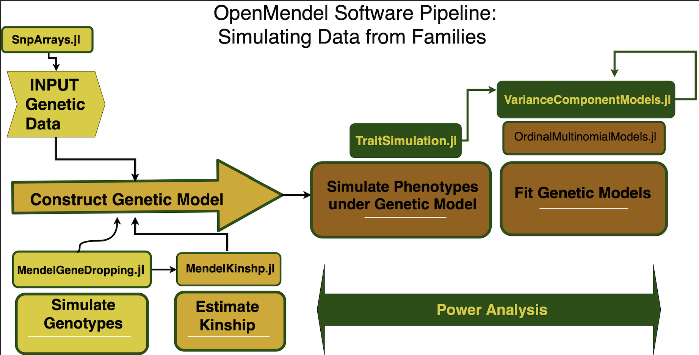

# TraitSimulation.jl 

Authors: Sarah Ji, Kenneth Lange, Janet Sinsheimer, Jin Zhou, Hua Zhou, Eric Sobel

We present TraitSimulation, an open-source Julia package that makes it trivial to quickly simulate phenotypes under a variety of genetic architectures. This package is integrated into our larger OpenMendel suite of software tools for easy downstream analyses. Julia was purpose-built for scientific programming and provides tremendous speed and memory efficiency, extensive libraries, and easy access to multi-CPU and GPU hardware and to distributed cloud-based parallelization. It is designed to encourage flexible trait simulation with the standard devices of applied statistics, generalized linear models (GLMs)and generalized linear mixed models (GLMMs).TraitSimulation also accommodates many study designs: unrelateds, sibships, pedigrees, or a mixture of all three. 

## Background

Statistical geneticists employ simulation to estimate the power of proposed studies, test new analysis tools, and evaluate properties of causal models. Although there are existing trait simulators, there is ample room for modernization of currently available simulation models and computing platforms.For example, most phenotype simulators are limited to Gaussian traits or traits transformable to normality, ignoring qualitative traits and realistic, non-normal trait distributions. Modern computer languages, such as Julia, that accommodate parallelization and cloud-based computing are now mainstream but rarely used inolder applications. To meet the challenges of contemporary big studies, it is nearly imperative for geneticists to adopt new computational tools. Although GPU and Threading capabilities are relatively new and under current development, we explore the potential of these language features and present the results to users who are interested in Julia. Users who wish to play with the prototype GPU code for simulation can find the file in the test folder, but we warn users that the CuArrays package will not install if the proper GPU machinery is not detected. 

## Demonstration

##### Example Data

We can use the OpenMendel package [SnpArrays.jl](https://openmendel.github.io/SnpArrays.jl/latest/) to both read in and write out PLINK formatted files. Available in the data directory under the [Example_Data](https://openmendel.github.io/SnpArrays.jl/latest/#Example-data-1) section of this package, we use the file `"EUR_SUBSET"` for the demonstration how to simulate phenotypic traits on PLINK formatted data. For convenience we use the common assumption that the residual covariance among two relatives can be captured by the additive genetic variance times twice the kinship coefficient.

In each simulation model, the user can specify parameters, along with the number of repetitions for each simulation model as desired. By default, the simulation will return the result of a single simulation.

### Double check that you are using Julia version 1.0 or higher by checking the machine information


```julia
versioninfo()
```

    Julia Version 1.4.0
    Commit b8e9a9ecc6 (2020-03-21 16:36 UTC)
    Platform Info:
      OS: macOS (x86_64-apple-darwin18.6.0)
      CPU: Intel(R) Core(TM) i7-7700HQ CPU @ 2.80GHz
      WORD_SIZE: 64
      LIBM: libopenlibm
      LLVM: libLLVM-8.0.1 (ORCJIT, skylake)


```julia
using Random, Plots, DataFrames, LinearAlgebra 
using SnpArrays, TraitSimulation, GLM, StatsBase, OrdinalMultinomialModels
Random.seed!(1234);
```

# Reading genotype data using SnpArrays

First use `SnpArrays.jl` to read in the genotype data. We use PLINK formatted data with the same prefixes for the .bim, .fam, .bed files.

SnpArrays is a very useful utility and can do a lot more than just read in the data. More information about all the functionality of SnpArrays can be found at:
https://openmendel.github.io/SnpArrays.jl/latest/

As missing genotypes are often due to problems making the calls, the called genotypes at a marker with too much missing genotypes are potentially unreliable. By default, SnpArrays filters to keep only the genotypes with success rates greater than 0.98 and the minimum minor allele frequency to be 0.01. If the user wishes to change the stringency, change the number given in filter according to [SnpArrays](https://openmendel.github.io/SnpArrays.jl/latest/#Fitering-1).


```julia
filename = "EUR_subset"
EUR = SnpArray(SnpArrays.datadir(filename * ".bed"));
```


```julia
rowmask, colmask =  SnpArrays.filter(EUR)
minor_allele_frequency = maf(EUR);
people, snps = size(EUR)
```


    (379, 54051)


```julia
EUR_data = SnpData(SnpArrays.datadir(filename));
```

Here we will use identify by name, which locus to include, first subset the names of all the loci into a vector called `snpid`  and then call the following command to store our design matrix for the model that includes sex and locus of choice.


```julia
bimfile = EUR_data.snp_info # store the snp_info with the snp names

snpid  = bimfile[!, :snpid] # store the snp names in the snpid vector

causal_snp_index = findall(x -> x == "rs150018646", snpid) # find the index of the snp of interest by snpid
```


    1-element Array{Int64,1}:
     82


Additionally, we will control for sex, with females as the baseline group, `sex = 0.0`. We want to find the index of this causal locus in the snp_definition (.bim) file and then subset that locus from the genetic marker data above. Make note of julia's ternary operator '?' which allows us to make this conversion efficiently!

Using SnpArrays.jl we can then use the `convert` and `@view` commands to get the appropriate conversion from SnpArray to a computable vector of Float64. 


```julia
locus = convert(Vector{Float64}, @view(EUR[:, causal_snp_index[1]]))
famfile = EUR_data.person_info
sex = map(x -> strip(x) == "F" ? 0.0 : 1.0, famfile[!, :sex])
intercept = ones(length(sex))
X_covar = [intercept sex]
X = [intercept sex locus]
```


    379×3 Array{Float64,2}:
     1.0  1.0  2.0
     1.0  1.0  1.0
     1.0  1.0  2.0
     1.0  1.0  2.0
     1.0  1.0  2.0
     1.0  1.0  2.0
     1.0  1.0  2.0
     1.0  1.0  2.0
     1.0  1.0  2.0
     1.0  1.0  2.0
     1.0  1.0  2.0
     1.0  1.0  2.0
     1.0  1.0  2.0
     ⋮         
     1.0  1.0  2.0
     1.0  1.0  2.0
     1.0  1.0  1.0
     1.0  1.0  2.0
     1.0  1.0  2.0
     1.0  1.0  2.0
     1.0  1.0  2.0
     1.0  1.0  2.0
     1.0  1.0  2.0
     1.0  1.0  2.0
     1.0  1.0  2.0
     1.0  1.0  2.0


# Example 1: GLM Trait

In this example we first demonstrate how to use the GLM.jl package to simulate a trait from unrelated individuals.  We specify the fixed effects and the phenotype distribution, and output the simulation results.

$Y \sim Poisson(\mu = g^{-1}(XB))$

A more thorough application of this GLM TraitSimulation applied to an Iterative Hard Thresholding problem under MendelIHT can be found here:

```@contents
Pages = [
    "examples/testing_MendelIHT_glm.md"
]
Depth = 2
```

## GLM Traits from Unrelated Individuals

$ Y_{n \times 1} \sim Poisson(\mu_{n \times 1} = X\beta)$


```julia
β = [1; 0.2; 0.5]
dist = Poisson()
link = LogLink()
GLMmodel = GLMTrait(X, β, dist, link)
```

    Generalized Linear Model
      * response distribution: Poisson
      * link function: LogLink
      * sample size: 379  * fixed effects: 3


```julia
Simulated_GLM_Traits = simulate(GLMmodel)
```

    379-element Array{Int64,1}:
      4
      8
      7
     10
     10
     11
      7
      9
      8
      9
      6
      9
     10
      ⋮
      7
     11
      5
     11
      9
      7
      5
      8
      4
     12
     16
     10


# Example 2: VCM Trait
In this example we show how to generate data so that the related individuals have correlated trait values even after we account for the effect of a snp, a combination of snps or other fixed effects. We simulate data under a variance component model so that we can model residual dependency among individuals. 

We note models with additional variance components can also be specified, as long as they are sensible (positive semi definite).

## VCMTrait UK Biobank Demo:
For the univariate and bivariate Variance Component Model, we include in the Real Data Examples section our step-by-step procedure of simultaneously simulating and fitting to get the genetic power. 

$Y \sim N(\mu, 4* 2GRM + 2*I_n)$

$Y \sim N(\mathbf{\mu}, \sigma_a \otimes 2GRM + \sigma_e \otimes I_n)$

where we can calculate the estimated empirical kinship matrix $2*\hat{\Phi}_{GRM}$ using [SnpArrays.jl](https://openmendel.github.io/SnpArrays.jl/latest/#Genetic-relationship-matrix-1).
Due to privacy of the data, we include only the html file for viewing. 

```@contents
Pages = [
    "examples/ukbiobank_vcm_power.md"
]
Depth = 2
```

We include some other variance component model examples for family data as follows:


## Rare Variant VCM Related Individuals

In this example we show how to generate data so that the related individuals have correlated trait values even after we account for the effect of a snp, a combination of snps or other fixed effects. We simulate data under a linear mixed model so that we can model residual dependency among individuals. 

$Y \sim \text{Normal}(\mathbf{\mu}_{n \times 1} = X\beta, \Sigma_{n \times n} = \sigma_A \times 2\hat{\Phi}_{GRM} + \sigma_E \times I_n)$

This example is meant to simulate data in a scenario in which a number of rare mutations in a single gene can change a trait value. We model the residual variation among relatives with the additive genetic variance component and we include 20 simulated rare variants in the mean portion of the model, defined as loci with minor allele frequencies greater than 0.002 but less than 0.02.

Specifically we are generating a single normal trait controlling for family structure with residual heritabiity of 67%, and effect sizes for the variants generated as a function of the minor allele frequencies. The rarer the variant the greater its effect size.

In practice rare variants have smaller minor allele frequencies, but we are limited in this tutorial by the relatively small size of the data set. Note also that our modeling these effects as part of the mean is not meant to imply that the best way to detect them would be a standard association analysis. Instead we recommend a burden or SKAT test.


```julia
GRM = grm(EUR, minmaf = 0.05);
```

### `Genotype Simulation:`

Say our study population has a sample size of `n` people and we are interested in studying the effect of the causal snp with a predetermined minor allele frequency. We use the minor allele frequency of the causal variant to simulate the SnpArray under Hardy Weinberg Equillibrium (HWE), using the `snparray_simulation` function as follows:
    
    
| Genotype | Plink/SnpArray |  
|:---:|:---:|  
| A1,A1 | 0x00 |  
| missing | 0x01 |
| A1,A2 | 0x02 |  
| A2,A2 | 0x03 |  
    

Given a vector of minor allele frequencies, specify `maf = [0.2, 0.25, 0.3]`, for each specified allele it will simulate a SnpArray under HWE and ouput them together. This function samples from the genotype vector under HWE and returns the compressed binary format under SnpArrays.


```julia
maf_rare = rand([0.002, 0.004, 0.008, 0.01, 0.012, 0.015, 0.02], 20)
rare_snps = snparray_simulation(maf_rare, 379)
```


    379×20 SnpArray:
     0x00  0x00  0x00  0x00  0x00  0x00  …  0x00  0x00  0x00  0x00  0x00  0x00
     0x00  0x00  0x00  0x00  0x00  0x00     0x00  0x00  0x00  0x00  0x00  0x00
     0x00  0x00  0x00  0x00  0x00  0x00     0x00  0x00  0x00  0x00  0x00  0x00
     0x00  0x00  0x00  0x00  0x00  0x00     0x00  0x00  0x00  0x00  0x00  0x00
     0x00  0x00  0x00  0x00  0x00  0x00     0x00  0x00  0x00  0x00  0x00  0x00
     0x00  0x00  0x00  0x00  0x00  0x00  …  0x00  0x00  0x00  0x00  0x00  0x00
     0x00  0x00  0x00  0x00  0x00  0x00     0x00  0x00  0x00  0x00  0x00  0x00
     0x00  0x00  0x00  0x00  0x00  0x00     0x00  0x00  0x00  0x00  0x00  0x00
     0x00  0x00  0x00  0x00  0x00  0x00     0x00  0x00  0x00  0x00  0x00  0x00
     0x00  0x00  0x00  0x00  0x00  0x00     0x00  0x00  0x00  0x00  0x00  0x00
     0x00  0x00  0x00  0x00  0x00  0x00  …  0x00  0x00  0x00  0x00  0x00  0x00
     0x00  0x00  0x00  0x00  0x00  0x00     0x00  0x00  0x00  0x00  0x00  0x00
     0x00  0x00  0x00  0x00  0x00  0x00     0x00  0x00  0x00  0x00  0x00  0x00
        ⋮                             ⋮  ⋱           ⋮                    
     0x00  0x00  0x00  0x00  0x00  0x00     0x00  0x00  0x00  0x00  0x00  0x00
     0x00  0x00  0x00  0x00  0x00  0x00     0x00  0x00  0x00  0x00  0x00  0x00
     0x00  0x00  0x00  0x00  0x00  0x00     0x00  0x00  0x00  0x00  0x00  0x00
     0x00  0x00  0x00  0x00  0x00  0x00  …  0x00  0x00  0x00  0x00  0x00  0x00
     0x00  0x00  0x00  0x00  0x00  0x00     0x00  0x00  0x00  0x00  0x00  0x00
     0x00  0x00  0x00  0x00  0x00  0x00     0x00  0x00  0x00  0x00  0x00  0x00
     0x00  0x00  0x02  0x00  0x00  0x00     0x00  0x00  0x00  0x00  0x00  0x00
     0x02  0x00  0x00  0x00  0x00  0x00     0x00  0x00  0x00  0x00  0x00  0x00
     0x00  0x00  0x00  0x00  0x00  0x00  …  0x00  0x00  0x00  0x00  0x00  0x00
     0x00  0x00  0x00  0x02  0x00  0x00     0x00  0x00  0x00  0x00  0x00  0x00
     0x00  0x00  0x00  0x00  0x00  0x00     0x00  0x00  0x00  0x00  0x00  0x00
     0x00  0x00  0x00  0x00  0x00  0x00     0x02  0x00  0x00  0x00  0x00  0x00


```julia
β_covar = [1.0; 0.6]
I_n = Matrix{Float64}(I, size(GRM))
vc = @vc [0.01][:,:] ⊗ (GRM + I_n) + [0.9][:, :] ⊗ I_n
sigma, v = vcobjtuple(vc)
rare_20_snp_model = VCMTrait(X_covar, β_covar[:, :], rare_snps, maf_rare[:, :], [sigma...], [v...])
```


    Variance Component Model
      * number of traits: 1
      * number of variance components: 2
      * sample size: 379


```julia
Rare_SNP_Trait = simulate(rare_20_snp_model)
```


    379×1 Array{Float64,2}:
     0.8088744352540489
     1.6701367617702745
     1.8455248160731537
     0.8508388343337788
     0.9712931279208524
     0.6887865756651992
     2.9436570129936905
     1.808457300723279
     1.1133732340741647
     1.0798778322598372
     0.8779238588613009
     2.338615502643955
     3.392334665830318
     ⋮
     3.654119285594163
     1.4716923062049176
     1.7276952768730827
     1.3970739033596746
     1.4755462272829616
     2.981506123686394
     1.6977542002518275
     3.09839068211269
     3.225180822413689
     2.7490032145653913
     3.8705735842017255
     2.7194612533505413


### Multiple Traits, Multiple Variance Components? Easy.

This example extends the variance component model in the previous example to demo how to efficiently account for any number of other random effects, in addition to the additive genetic and environmental variance components. 

Y ~ MatrixNormal($M = XB$, $Omega = \sum_{k=1}^m \Sigma_{k}$ $\otimes V_k$)

We note that this form can also accompany more than 2 variance components.

I encourage for those interested, to look at [this example](https://github.com/OpenMendel/TraitSimulation.jl/blob/master/docs/benchmarking_VCM.ipynb) where we demonstrate the simlation of $d = 2$ traits with $m = 10$ variance components, and benchmark it against the available method using the MatrixNormal distribution in Julia package, [Distributions.jl](https://juliastats.org/Distributions.jl/latest/matrix/#Distributions.MatrixNormal).


# Example 3: Ordered Multinomial Trait

Now we demonstrate on the `OrderedMultinomialTrait` model object in TraitSimulation.jl.

### Ordered Multinomial Trait

Recall that this phenotype is special, in that the [OrdinalMultinomialModels](https://openmendel.github.io/OrdinalMultinomialModels.jl/stable/#Syntax-1) package provides Julia utilities to fit ordered multinomial models, including [proportional odds model](https://en.wikipedia.org/wiki/Ordered_logit) and [ordered Probit model](https://en.wikipedia.org/wiki/Ordered_probit) as special cases. 


```julia
θ = [1.0, 1.2, 1.4]
Ordinal_Model = OrderedMultinomialTrait(X, β, θ, LogitLink())
```


    Ordinal Multinomial Model
      * number of fixed effects: 3
      * number of ordinal multinomial outcome categories: 4
      * link function: LogitLink
      * sample size: 379


```julia
Ordinal_Trait = simulate(Ordinal_Model)
```


    379-element Array{Int64,1}:
     2
     4
     4
     1
     1
     1
     1
     4
     1
     4
     4
     3
     4
     ⋮
     4
     4
     2
     1
     1
     4
     1
     4
     4
     4
     4
     4


### Simulate Ordered Multinomial Logistic

Specific to the Ordered Multinomial Logistic model is the option to transform the multinomial outcome (i.e 1, 2, 3, 4) into a binary outcome for logistic regression. 

Although by default is the multinomial simulation above, the user can simulate from the transformed logistic outcome for example by specifying arguments: `Logistic = true` and `threshold = 2` the value to use as a cutoff for identifying cases and controls. **(i.e if y > 2 => y_logit == 1).** We note if you specify `Logistic = true` and do not provide a threshold value, the function will throw an error to remind you to specify one.


```julia
Logistic_Trait = simulate(Ordinal_Model, Logistic = true, threshold = 2)
```


    379-element Array{Int64,1}:
     1
     1
     1
     1
     1
     1
     0
     0
     1
     1
     1
     0
     1
     ⋮
     1
     1
     0
     1
     1
     1
     0
     0
     1
     1
     1
     1


# Example 4: GLMM Trait Simulation

Next, we demonstrate how to simulate a Poisson Trait, after controlling for family structure.  


```julia
dist = Poisson()
link = LogLink()

vc = @vc [0.01][:,:] ⊗ (GRM + I_n) + [0.9][:, :] ⊗ I_n
GLMMmodel = GLMMTrait(X, β[:,:], vc, dist, link)
```


    Generalized Linear Mixed Model
      * response distribution: Poisson
      * link function: LogLink
      * number of variance components: 2
      * sample size: 379


```julia
Y = simulate(GLMMmodel)
```


    379×1 Array{Int64,2}:
     31
      3
      5
      4
      9
     10
      3
     10
     17
      6
     16
     24
     16
      ⋮
     18
      3
      4
      2
     28
      5
      1
      6
     32
      0
      9
     13


# Power Calculation



Now we demonstrate the use of the simulations to generates data sets allowing researchers to accurately check the validity of programs and to calculate power for their proposed studies. For these examples we will demo the full power pipeline contatined within the OpenMendel environment.

We illustrate this example in three digestable steps as shown in the figure: 
   * The first by simulating genotypes and covariate values representative for our study population.
   * Carry over the simulated design matrix from (1) to create the OrderedMultinomialTrait model object.
   * Simulate off the OrderedMultinomialTrait model object created in (2) and run the power analyses for the desired significance level.

Each column of this matrix represents each of the detected effect sizes, and each row of this matrix represents each simulation for that effect size. The user feeds into the function the number of simulations, the vector of effect sizes, the TraitSimulation.jl model object, and the random seed.

For GLMTrait objects, the `realistic_power_simulation` function makes the appropriate calls to the GLM.jl package to get the simulation p-values obtained from testing the significance of the causal locus using the Wald Test by default. However since the GLM.jl package has its limitations, we include additional power utilities that make the appropriate function calls to the [OrdinalMultinomialModels](https://openmendel.github.io/OrdinalMultinomialModels.jl/stable/#Syntax-1) to get the p-value obtained from testing the significance of the causal locus. Variance Component Models for VCMTrait objects can be fit using [VarianceComponentModels.jl](https://openmendel.github.io/VarianceComponentModels.jl/latest/), and we demo for UK Biobank data in the docs. 


## UKBiobank Power Pipeline

```@contents
Pages = [
    "examples/ukbiobank_vcm_power.md",
    "examples/ukbiobank_ordered_multinomial_power.md"
]
Depth = 2
```

For each effect size in $\gamma_s,$ in each column we have the p-values obtained from testing the significance of the causal locus `nsim = 1000` times under the desired model, and the `randomseed = 1234`.

### `Try it Yourself Exercises: `

With the remaining time we encourage you to play with the simulation models above. 

(1) If you change the significance level, α, what would happen to the plot of the power? How would the plot change with a smaller value of α ? 

(2) What if you change the sample size to be smaller than `n = 5000`? How does the power look as a function of the effect size when `n = 2500`? 

(3) What if we changed the minor allele frequency of the SNP of interest from `maf = 0.2` to say `maf = 0.3` ?

## Citations: 

[1] Lange K, Papp JC, Sinsheimer JS, Sripracha R, Zhou H, Sobel EM (2013) Mendel: The Swiss army knife of genetic analysis programs. Bioinformatics 29:1568-1570.`


[2] OPENMENDEL: a cooperative programming project for statistical genetics.
[Hum Genet. 2019 Mar 26. doi: 10.1007/s00439-019-02001-z](https://www.ncbi.nlm.nih.gov/pubmed/?term=OPENMENDEL).

[3] German, CA, Sinsheimer, JS, Klimentidis, YC, Zhou, H, Zhou, JJ. Ordered multinomial regression for genetic association analysis of ordinal phenotypes at Biobank scale. Genetic Epidemiology. 2019; 1– 13. https://doi.org/10.1002/gepi.22276

